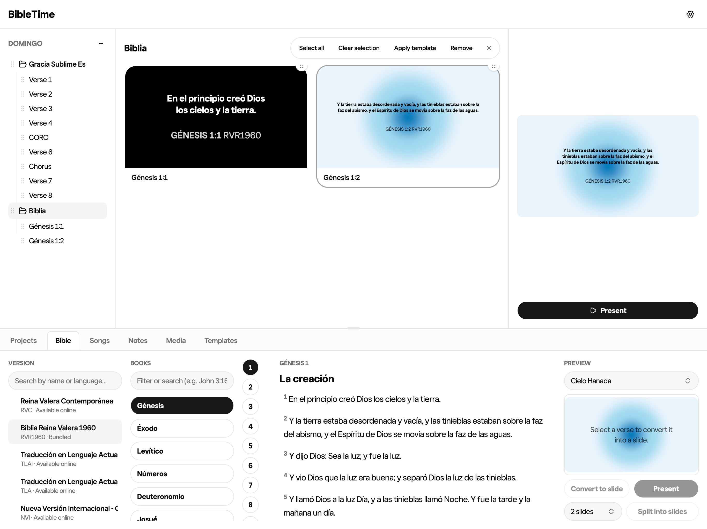
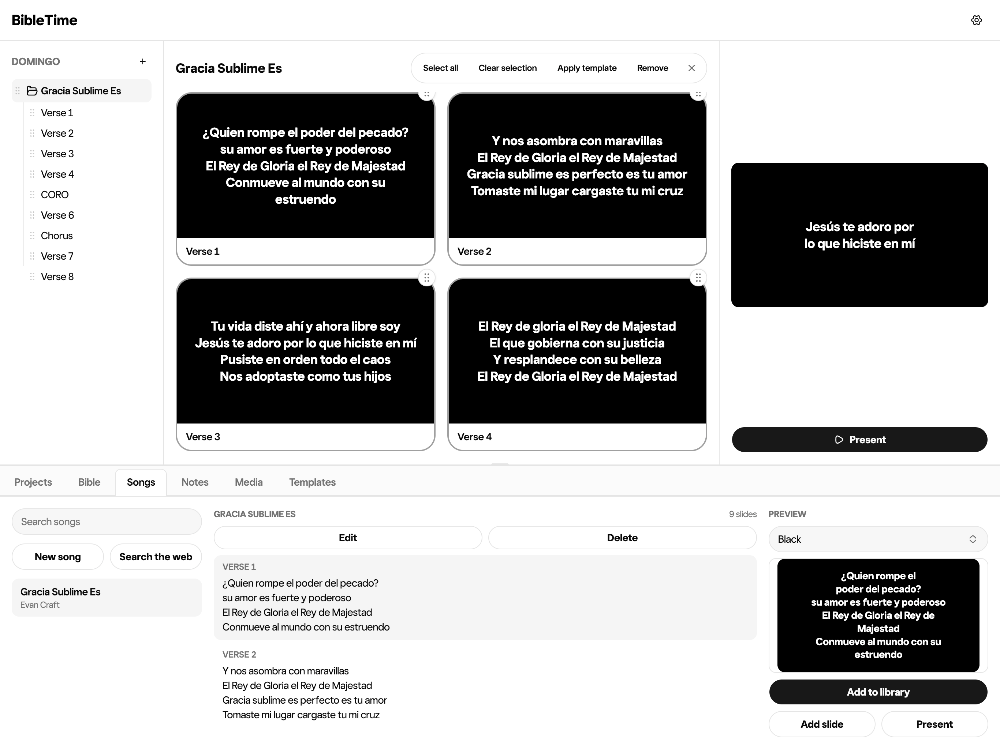
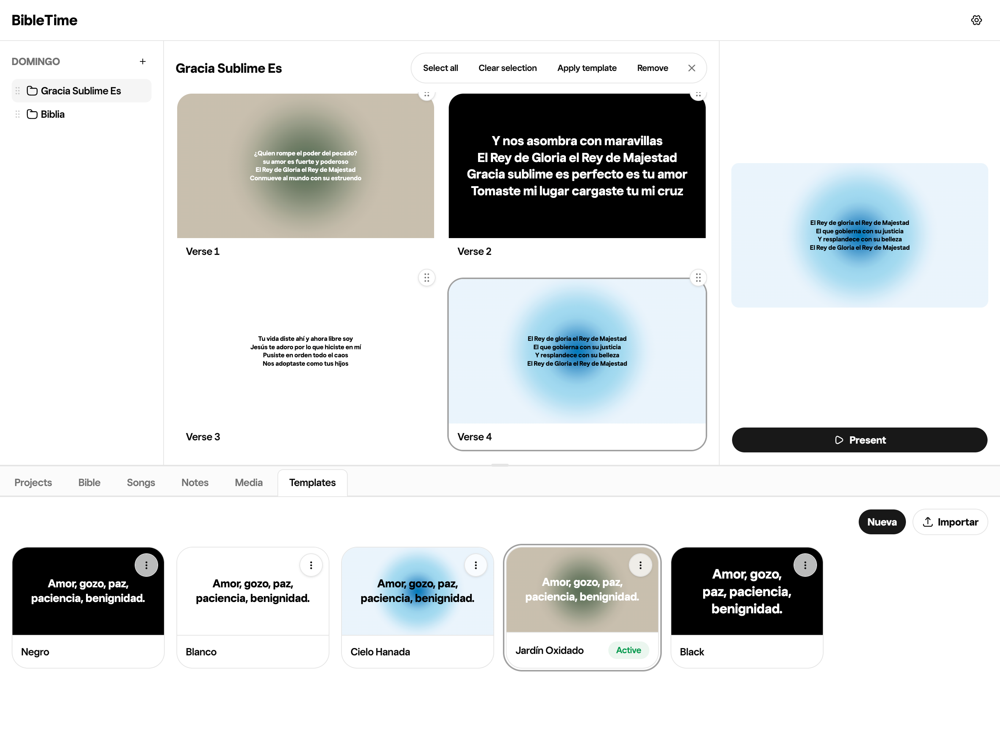
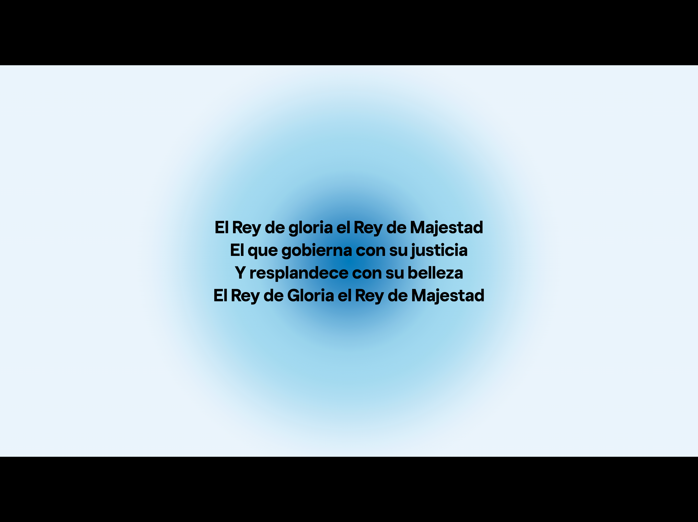

<div align="center">

# BibleTime

**A free, local-first presentation app for churches and ministries.**

Bible verses, song lyrics, sermon slides, notes, images, and video — on your projector, with a
clean control panel for whoever's running the booth.

[**⬇ Download**](https://github.com/anthonycifuentes/bibletime/releases/latest) ·
[**🌐 Try it in your browser**](https://bibletime-app.vercel.app) ·
[**📖 Install guide**](./docs/install.md)

[](./LICENSE)
[](https://github.com/anthonycifuentes/bibletime/releases)
[](https://github.com/anthonycifuentes/bibletime/actions/workflows/ci.yml)

</div>



---

## What it is

BibleTime sits between ProPresenter and a slide deck: enough breadth to run a whole service,
simple enough that a volunteer can use it without training, and fully usable with the wifi down.

- **Free, forever.** No account, no login, no subscription, no trial.
- **Works offline.** Your service plan shouldn't depend on the church internet.
- **Runs anywhere.** Desktop app for macOS, Windows, and Linux — or straight in a browser.

---

## Features

| | |
| --- | --- |
| 📖 **Bible** | Browse by book → chapter → verse or jump to a reference. The Reina-Valera 1960 is bundled and offline; more translations download on demand. |
| 🎵 **Songs** | Lyrics split into labeled sections (verse, chorus, bridge), with slide-by-slide navigation and next-slide preview while you sing. |
| 🖼️ **Media** | Drag in images and video. Send them straight to the screen or use them as slide backgrounds. |
| 📝 **Notes** | Template-based note slides for announcements and pre-service rotation. |
| 🎨 **Templates** | Reusable slide styles — typography, gradients, and animated backgrounds — applied across a whole service. |
| 📺 **Presentation** | A console for the operator, a clean output window for the congregation. No control UI ever leaks onto the projector. |
| 📁 **Projects** | Build a running order from any module, save it, and duplicate last week's plan as a starting point. |

<details>
<summary><b>More screenshots</b></summary>

**Songs**


**Templates**


**Template builder**


**Presenting**


</details>

---

## Install

**[Download the latest release →](https://github.com/anthonycifuentes/bibletime/releases/latest)**

| Your computer | File |
| --- | --- |
| Mac (Apple Silicon) | `BibleTime-<version>-arm64.dmg` |
| Mac (Intel) | `BibleTime-<version>-x64.dmg` |
| Windows | `BibleTime-<version>-x64.exe` |
| Linux | `BibleTime-<version>-x64.AppImage` |

> [!IMPORTANT]
> **Your computer will warn you that the app is unrecognized.** BibleTime's builds aren't
> code-signed — certificates cost more than a free project has — so macOS, Windows, and Linux
> each show a warning the first time you open it. The
> **[install guide](./docs/install.md)** has the exact steps for each platform.

Prefer not to install anything? BibleTime runs in the browser at
**<https://bibletime-app.vercel.app>**.

---

## Development

A pnpm + Turborepo monorepo. You need **Node.js 20+** and **pnpm 10.33.4** (`corepack enable`
gets you the right version).

```bash
git clone https://github.com/anthonycifuentes/bibletime.git
cd bibletime
pnpm install
pnpm dev                 # http://localhost:3000
```

| Command | Does |
| --- | --- |
| `pnpm dev` | Run the web app |
| `pnpm --filter desktop dev` | Run the Electron shell against it |
| `pnpm build` | Build everything |
| `pnpm lint` | Lint everything |
| `pnpm typecheck` | Typecheck everything |
| `pnpm --filter desktop package` | Build installers into `apps/desktop/release/` |

```
apps/
  bibletime/   # the app — TanStack Start (React), package name "web"
  desktop/     # Electron shell, package name "desktop"
packages/
  ui/          # shared shadcn/ui components
  fonts/       # bundled typefaces
```

See [`docs/architecture.md`](./docs/architecture.md) for how the pieces fit together — especially
the desktop shell, which serves the app from a bundled SSR server rather than static files.

---

## Documentation

| | |
| --- | --- |
| [Install guide](./docs/install.md) | Per-platform install, unsigned-build warnings, projector setup |
| [Architecture](./docs/architecture.md) | Design principles, repo layout, module conventions, OpenSpec flow |
| [Bible data](./docs/bible-data.md) | Where Scripture text comes from, its licensing, adding translations |
| [Release runbook](./docs/release.md) | Cutting a release and configuring repository protections |

---

## Contributing

Contributions are welcome. Start with [`CONTRIBUTING.md`](./CONTRIBUTING.md) — it covers setup,
the checks your PR needs to pass, the module conventions, and how changes get planned.

- 🐛 [Report a bug](https://github.com/anthonycifuentes/bibletime/issues/new/choose)
- 💡 [Request a feature](https://github.com/anthonycifuentes/bibletime/issues/new/choose)
- 🤝 [Code of Conduct](./CODE_OF_CONDUCT.md)
- 🔒 [Security policy](./SECURITY.md) — please don't file vulnerabilities as public issues

---

## License

BibleTime's source code is [MIT licensed](./LICENSE) — free to use, modify, and distribute.

> [!NOTE]
> **Bundled fonts and Bible text are not covered by the MIT license.** In particular, the
> Reina-Valera 1960 text is under copyright by Sociedades Bíblicas Unidas and is not public
> domain. If you fork or redistribute BibleTime, read
> [`THIRD_PARTY_NOTICES.md`](./THIRD_PARTY_NOTICES.md) first.

<div align="center">
<br>
Built for the church.
</div>
